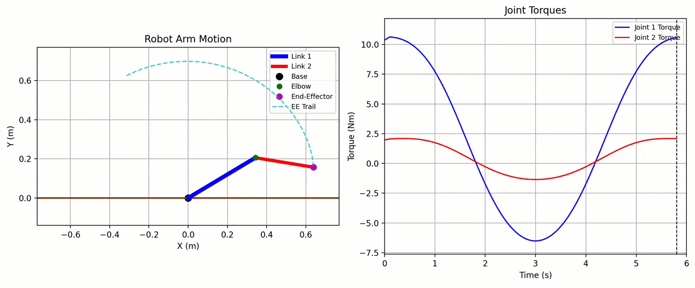

# Playing with Lagrangians for 2 DoF arm

Implementation of Lagrangians for controlling a 2 DoF arm.

This projects uses [`uv`](https://github.com/astral-sh/uv) for easier dependency management, you may run it via `uv run main.py`.

Project structure:
- `main.py`: Visualization code for the 2 DoF arm and torques with simple trajectory. Mostly written by a combination of LLMs.
- `equations.py`: Contains the implementation for the Lagrangian equations of motion for the 2 DoF arm. Written by me as an exercise.
